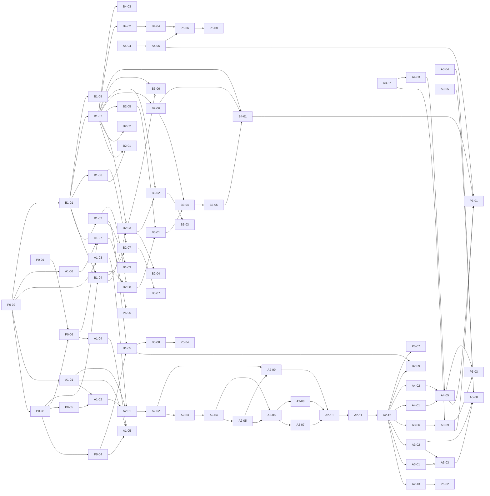

# タスクインデックス

全 81 タスクの一覧と依存関係。`node scripts/sync-tasks.mjs --summary` で工数集計が見られる。

## 工数サマリー (見積もり)

| 担当 | 合計工数 |
|---|---|
| A (バックエンド/LLM) | **88.5h** |
| B (フロントエンド/UI) | **62h** |
| both (共同) | **22.5h** |
| **総計** | **173h** |

| Phase | 工数 | 内容 |
|---|---|---|
| Phase 0 (Setup) | 14h | プロジェクト初期化・契約凍結 |
| Phase 1 (Foundation) | 27.5h | LLM/UI 基盤、モック契約 |
| Phase 2 (Truth Compiler) | 52h | 真相生成・検証・序盤画面 |
| Phase 3 (Game Loop) | 38.5h | 議論/尋問/夜、ピン留め |
| Phase 4 (Trial & End) | 23h | 裁判・結果・真相開示 |
| Phase 5 (Polish) | 18h | バランス調整・デプロイ |

> 1 人 25h/週 想定だと、A は ~3.5 週、B は ~2.5 週。ボトルネックは A の Phase 2 (52h のうち 33.5h)。B はモックモードで Phase 2 から先行できるので壁打ちが必要なときは Phase 1 後半に余裕がある A の手すきを使う設計。

---

## クリティカルパス

```
P0-02 (monorepo) → P0-03 (types) → P0-04 (contracts)
                ↘
                  A1-01 (Gemini) → A1-02 (validator) → A2-01..06 (Generator)
                                                     → A2-07..10 (Validator/Repairer)
                                                     → A2-11 (loop) → A2-12 (startGame)
                                                                   ↘
                                                                     A3-01/02 (Speaker) → A3-08/09 (callable)
                                                                                       → A4-01..06 (Trial/Reveal)
                                                                                                  ↘
                                                                                                    P5-01..08
```

A の Phase 2 (真相生成系) が最長経路。B はモックで先行できる。

---

## Phase 0 — Setup (共同, 14h)

| ID | Title | Assignee | Est. | Depends |
|---|---|---|---|---|
| P0-01 | Firebase プロジェクト作成 | both | 1h | — |
| P0-02 | pnpm monorepo セットアップ | both | 2h | — |
| P0-03 | 共有型定義 (packages/shared/types) | both | 3h | P0-02 |
| P0-04 | Cloud Functions callable 契約 | both | 1h | P0-03 |
| P0-05 | zod スキーマ初稿 | both | 2h | P0-03 |
| P0-06 | Firestore コレクション設計 + rules 初稿 | both | 1.5h | P0-01, P0-03 |
| P0-07 | ESLint / Prettier / Husky | both | 1h | P0-02 |
| P0-08 | GitHub repo + ブランチ保護 + PR テンプレ | both | 1h | — |
| P0-09 | CI (lint + typecheck + build) | both | 1.5h | P0-02, P0-07, P0-08 |

## Phase 1 — Foundation (並列, A:13h / B:14.5h)

| ID | Title | Assignee | Est. | Depends |
|---|---|---|---|---|
| A1-01 | Gemini クライアントラッパー | A | 2h | P0-01, P0-02 |
| A1-02 | JSON スキーマ検証ハーネス | A | 3h | P0-05, A1-01 |
| A1-03 | プロンプトテンプレ置き場の骨格 | A | 1h | P0-02 |
| A1-04 | Firestore Admin SDK ラッパー | A | 1.5h | P0-01, P0-06 |
| A1-05 | startNewGame スタブ実装 | A | 2h | A1-01, A1-04, P0-04 |
| A1-06 | Functions emulator + Jest | A | 2h | P0-02 |
| A1-07 | Firestore rules emulator テスト | A | 1.5h | P0-06, A1-06 |
| B1-01 | Next.js + Tailwind 全体レイアウト | B | 2h | P0-02 |
| B1-02 | Firebase クライアント SDK 初期化 | B | 1h | P0-01, B1-01 |
| B1-03 | Anonymous Auth 自動ログインフロー | B | 1.5h | B1-02 |
| B1-04 | Zustand ゲームストア | B | 2h | P0-03, B1-01 |
| B1-05 | Functions callable ラッパー + モック | B | 2h | P0-04, B1-02 |
| B1-06 | ルーティング骨格 (App Router) | B | 1.5h | B1-01 |
| B1-07 | デザインシステム雛形 | B | 3h | B1-01 |
| B1-08 | ミステリーUIテーマ / カラートークン | B | 1.5h | B1-01 |

## Phase 2 — Truth Compiler & 序盤画面 (A:33.5h / B:19h)

| ID | Title | Assignee | Est. | Depends |
|---|---|---|---|---|
| A2-01 | Generator 事件骨格生成 | A | 3h | A1-01, A1-02, A1-03 |
| A2-02 | Generator キャラクター思惑生成 | A | 3h | A2-01 |
| A2-03 | Generator 夜間タイムライン生成 | A | 3h | A2-02 |
| A2-04 | Generator 証拠生成 (3 階層) | A | 3h | A2-03 |
| A2-05 | Generator 証言生成 | A | 2h | A2-04 |
| A2-06 | Generator deduction_path 生成 | A | 3h | A2-04, A2-05 |
| A2-07 | Validator 特定可能性検証 | A | 3h | A2-06 |
| A2-08 | Validator 論理整合性検証 | A | 3h | A2-06 |
| A2-09 | Validator 思惑整合性検証 | A | 2h | A2-02, A2-05 |
| A2-10 | Repairer 実装 | A | 3h | A2-07, A2-08, A2-09 |
| A2-11 | Truth Compiler 統合ループ | A | 2h | A2-10 |
| A2-12 | startNewGame 本実装 | A | 2h | A2-11, A1-04 |
| A2-13 | 連続生成成功率テスト | A | 1.5h | A2-12 |
| B2-01 | タイトル画面 | B | 2h | B1-06, B1-07 |
| B2-02 | ゲーム開始ローディング演出 | B | 1.5h | B1-07 |
| B2-03 | 村の概要画面 | B | 3h | B1-07, B1-04, P0-03 |
| B2-04 | キャラクタープロフィールモーダル | B | 2h | B2-03 |
| B2-05 | 議論ログ画面の枠 | B | 3h | B1-07, P0-03 |
| B2-06 | 証拠一覧画面 | B | 2.5h | B1-07, P0-03 |
| B2-07 | ナビゲーション | B | 2h | B1-04, B1-06 |
| B2-08 | Firestore real-time listener | B | 1.5h | B1-02, B1-04 |
| B2-09 | モック→本物 Functions 切替検証 | B | 1h | A2-12, B1-05 |

## Phase 3 — Game Loop (A:20h / B:18.5h)

| ID | Title | Assignee | Est. | Depends |
|---|---|---|---|---|
| A3-01 | 議論ログ生成 (Runtime Speaker) | A | 4h | A1-01, A1-02, A2-12 |
| A3-02 | 個別尋問回答生成 | A | 4h | A1-01, A1-02, A2-12 |
| A3-03 | 知識範囲ガード | A | 2h | A3-01, A3-02 |
| A3-04 | 信頼度変化計算 | A | 1.5h | P0-03 |
| A3-05 | 尋問ポイント管理 | A | 1h | A1-04, P0-03 |
| A3-06 | 夜間処理 | A | 3h | A2-12, A1-01 |
| A3-07 | 勝敗判定エンジン | A | 2h | P0-03, A1-04 |
| A3-08 | submitInterrogation 完成 | A | 1h | A3-02, A3-03, A3-04, A3-05 |
| A3-09 | submitNightAction 完成 | A | 1.5h | A3-06, A3-07 |
| B3-01 | 議論ログ画面 本実装 | B | 3h | B2-05, B2-08 |
| B3-02 | 尋問画面 | B | 4h | B1-07, B1-04, B2-03 |
| B3-03 | 尋問ポイント UI | B | 1h | B3-02, B2-07 |
| B3-04 | ピン留め機能 | B | 2.5h | B3-01, B2-06, B1-04 |
| B3-05 | 矛盾整理画面 | B | 2.5h | B3-04 |
| B3-06 | 夜フェーズ画面 | B | 2h | B1-07, B2-03 |
| B3-07 | フェーズ間トランジション演出 | B | 2h | B2-07 |
| B3-08 | エラーハンドリング | B | 1.5h | B1-05 |

## Phase 4 — Trial & End (A:12.5h / B:10.5h)

| ID | Title | Assignee | Est. | Depends |
|---|---|---|---|---|
| A4-01 | 容疑者弁明生成 | A | 3h | A1-01, A2-12 |
| A4-02 | 他キャラ反応生成 | A | 2h | A1-01, A2-12 |
| A4-03 | 判決処理 | A | 2h | A3-07 |
| A4-04 | スコア評価エンジン | A | 2.5h | P0-03, A1-04 |
| A4-05 | submitTrialDecision 完成 | A | 1h | A4-01, A4-02, A4-03 |
| A4-06 | revealTruth callable | A | 2h | A4-04, A1-04 |
| B4-01 | 裁判画面 | B | 4h | B1-07, B3-05, B2-06 |
| B4-02 | 結果画面 | B | 2.5h | B1-07 |
| B4-03 | 真相開示画面 | B | 3h | B1-07, P0-03 |
| B4-04 | 「もう一度プレイ」導線 | B | 1h | B4-02 |

## Phase 5 — Polish (共同, 18h)

| ID | Title | Assignee | Est. | Depends |
|---|---|---|---|---|
| P5-01 | バランス調整 | both | 3h | A4-05, A4-06, A3-09, B4-01 |
| P5-02 | プロンプト調整 (生成成功率) | A | 4h | A2-13 |
| P5-03 | LLM コスト / レイテンシ計測 | A | 2h | A3-09, A4-05 |
| P5-04 | エラーリカバリ強化 | both | 2h | B3-08 |
| P5-05 | Firestore rules 最終確認 | A | 1.5h | A1-07 |
| P5-06 | Firebase Hosting 本番デプロイ | both | 2h | B4-04, A4-06 |
| P5-07 | デモ用シードゲーム | A | 2h | A2-12 |
| P5-08 | README + プレイ手順 | both | 1.5h | P5-06 |

---

## 依存関係グラフ (Mermaid)



このグラフは手動メンテ。タスクを増やしたら更新する (将来 `sync-tasks.mjs --gen-mermaid` で自動化候補)。
